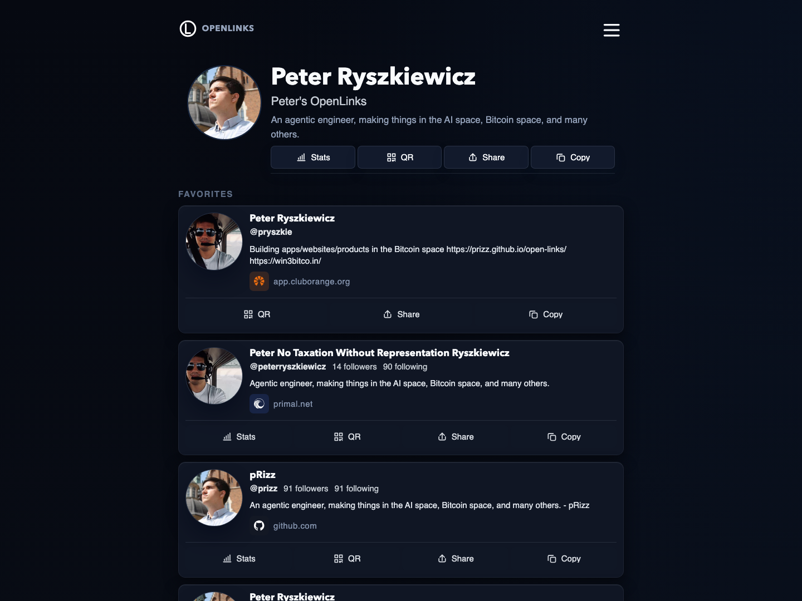
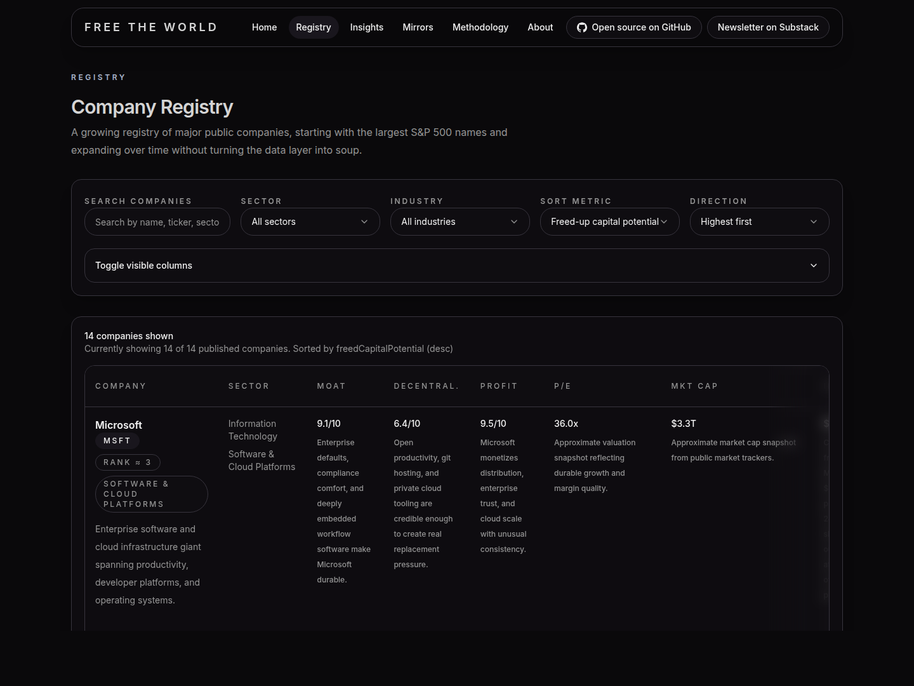
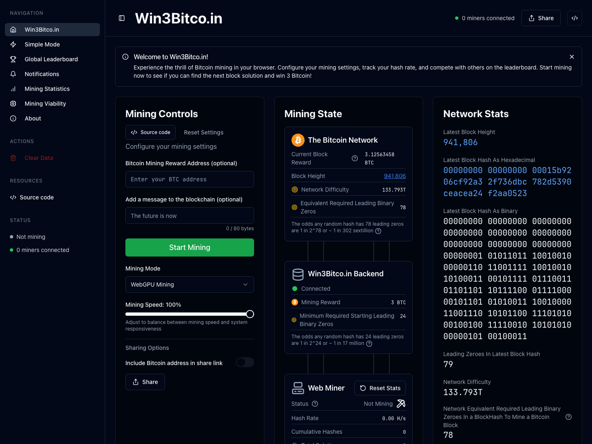

# Hi, I'm Peter 👋

📍 Chicago | Software Engineer at  | Founder, [Bright Builds LLC](https://brightbuilds.us/)

Chicago-based agentic engineer building free, open source, decentralized tools across AI, Bitcoin, and the web.

I care about software that expands freedom, reduces dependence on closed systems, and helps push the world toward more liberty and prosperity.

  

  
  
  
  
  

## Current projects

### [OpenLinks](https://openlinks.us/)

[Repo](https://github.com/pRizz/open-links)

A free, open source, version-controlled link-in-bio platform for people who want to own and customize their online presence.

### [Free The World](https://freetheworld.ai/)

[Repo](https://github.com/pRizz/free-the-world)

A research-driven registry tracking where AI, open source, Bitcoin-native coordination, and distributed manufacturing can break overpriced corporate moats.

### [Win3Bitco.in](https://win3bitco.in/)

[Repo](https://github.com/pRizz/open-bitcoin-web-miner)

An open Bitcoin mining experiment that lets anyone play around with real mining, inspect the proof, and learn how Bitcoin mining works using their own computer's CPU or GPU. It offers a hands-on way to understand where consumer and home mining fit in a more open future, including the astronomically low but real chance of actually winning a block.

These projects look different on the surface, but they all point in the same direction: more user ownership, more open coordination, and more room for disruptive ideas that do not require permission from gatekeepers.

## Why I build

I am interested in tools, protocols, and services that move power outward: toward users, builders, open networks, and smaller teams.

- Freedom is good.
- Open systems tend to outlast closed ones.
- AI keeps compressing expertise and raising the ceiling for small teams.
- Bitcoin makes more decentralized coordination possible.
- Software should expand human agency, not just lock people into another box.

## How I build

I base my recent projects, and the ones I build going forward, on the standards and patterns captured in [coding-and-architecture-requirements](https://github.com/bright-builds-llc/coding-and-architecture-requirements). It serves as the living reference for how I think about code quality, architecture, maintainability, and the overall shape of serious software projects, and it continues to evolve as I refine and discover my requirements.

This is the current map I use for thinking about AI tooling: which tools fit simple versus complex apps, and which ones produce quick vibes versus more durable engineered output.

The horizontal axis runs from simple to complex app complexity. The vertical axis runs from vibe-coded to vibe-engineered, with app durability increasing as you move upward.

- **Cursor / Codex Desktop** - The fastest path for quick builds, prototypes, and simple apps.
- **Codex Desktop (Plan Mode)** - My default once the work gets more moderate-to-complex and I want more durable structure.
- **Lovable (Plan Mode)** - Useful when I want to explore ideas with structure but the durability demands are still moderate.
- **Cursor Cloud Agents** - Best for complex, long-running work that can grind away in the background.
- **Get-Shit-Done (GSD)** - The most engineered and maintainable path when the build is serious and I want stronger process.

For the chart source and the evolving version of these opinions, see [my-tooling-opinions](https://github.com/pRizz/my-tooling-opinions).

## Quotes That Inspire Me

Some lines I keep coming back to:

> "Stay hungry, stay foolish."
>
> - Steve Jobs (1955-2011)

> "Take chances, make mistakes, get messy!"
>
> - Ms. Frizzle

> "Life's a garden, dig it."
>
> - Joe Dirt

> "Life is not a serious journey with a final destination, but rather a dance or musical act meant to be enjoyed in the present."
>
> - Paraphrase of Alan Watts (1915-1973)

> "No taxation without representation."
>
> - Commonly attributed to James Otis Jr. (1725-1783)

> "Be the change you want to see in the world."
>
> - Commonly attributed to Mahatma Gandhi (1869-1948)

> "… with liberty and justice, for all"
>
> - The Pledge of Allegiance of the United States

> "Deflation is the natural state of a free market. And only #Bitcoin can measure it."
>
> - Jeff Booth

> "There is no second best."
>
> - Michael Saylor

> "Human knowledge belongs to the world."
>
> - Milo Hoffman, Antitrust (2001)

> "Be curious. Read widely. Try new things. I think a lot of what people call intelligence just boils down to curiosity."
>
> - Aaron Swartz (1986-2013)

> "When you see a good move, look for a better one."
>
> - Commonly attributed to Emanuel Lasker (1868-1941), former World Chess Champion

## Selected writing

I write about Bitcoin, open systems, software, and the strange ways the future sneaks up on incumbents.

- **[Peter Schiff Accidentally Proves the Internet Is Worthless](https://peter.ryszkiewicz.us/p/peter-schiff-accidentally-proves)** - A light satirical aftertaste on why lazy anti-Bitcoin arguments often collapse into anti-internet arguments.
- **[Substack](https://peter.ryszkiewicz.us/)** - Notes, essays, and ideas in progress.

## Collaborate / say hi

If you are building in AI, Bitcoin, open systems, developer tooling, or weird and disruptive internet projects, I would love to hear from you.

- OSS contributors welcome
- Podcast and speaking invites welcome
- Best inbound: **[send me a message on Primal](https://primal.net/peterryszkiewicz)**

## Connect

  
  
  
  
  
  
  
  
  
  
  
  

